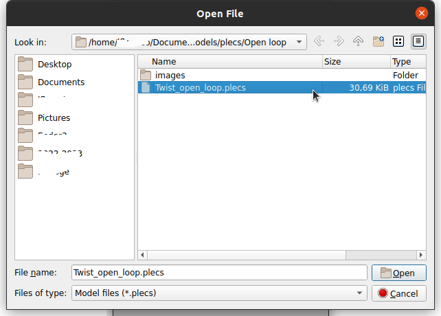
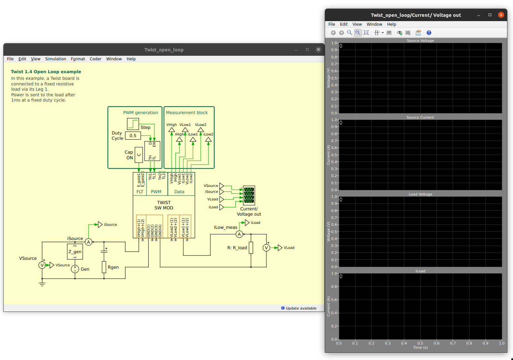
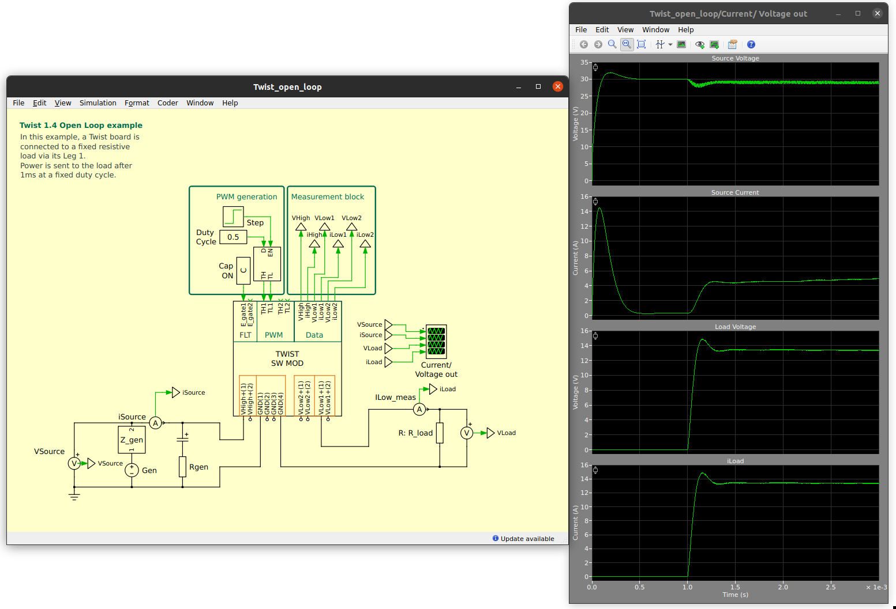

# First model example with PLECS

This page shows how to run your first example of a PLECS based OwnTech model.

## Requirements

Before you start, please make sure you fullfil the requirements below.

!!! note "Requirements"
     - Have installed and configured the licence of your [PLECS instance](getting_started.md#installing-plecs )
     - Setup the [OwnTech PLECS library](getting_started.md#getting-the-ownmodels-plecs-library).

## Running the open loop model for the first time

We have developed a first model that you can run out-of-the-box. Here are the steps to launch it.

**Step 1 -** In *PLECS Library Browser* go to *File->Open*

  

**Step 2 -** Navigate to the *Open loop* folder. Choose* the *Twist_open_loop.plecs* and click *Open*.

   

**Step 3 -** You will see the model and a scope window. Press *Ctrl+T* on your computer or click on *Simulation->Start*.

  

**Step 4 -** The simulation will run its course and give you the results as in the image below.

  

You can see an initial in-rush current for loading the Twist board capacitors. At 1 milisecond, the Twist board starts to operate and voltage goes up to around half of the generator voltage, as expected for a 50% duty cycle setup.

## Analyzing the model a little further

The open loop model will allow you to explore how the twist board operates.

The model input is a standard voltage source with an inductive impedence and a bus capacitor.

The output is a 1 Ohm resistor.

You are now able to run simulations. The next step is to run closed loop simulations using this model.
