# First model example with PLECS

This page shows how to run your first example of a PLECS based OwnTech model.

## Requirements

Before you start, please make sure you fullfil the requirements below.

!!! note "Requirements"
     - Have installed and configured the licence of your [PLECS instance](getting_started.md#installing-plecs )
     - Setup the [OwnTech PLECS library](getting_started.md#getting-the-ownmodels-plecs-library).

## Using the example model

We have developed a first model that you can run out-of-the-box. Here are the steps to launch it.

**Step 1 -** In *PLECS Library Browser* go to *File->Open*

  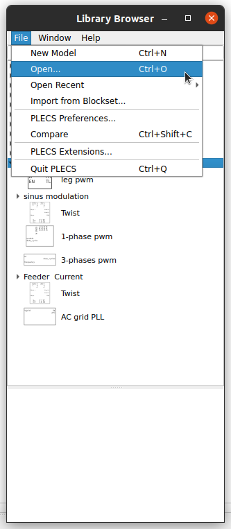

## Installing PLECS

To install PLECS, go to their website and download the [standalone package](https://www.plexim.com/download/standalone).
Choose your platform and follow the [instructions](https://www.plexim.com/support/installation_help/standalone).

!!! warning "PLECS LICENSE"
    There are three ways where you can use PLECS. Choose the one of your convenience.
    === "Trial license"
        PLECS provides a 90 days trial license for its products. Follow their [dedicated page](https://www.plexim.com/trial/standalone) to get yours.

    === "Demo mode"
        If you do not want to ask for a license, you can still use PLECS in its demo mode. You will still be able to run the simulations, but you will not be able to modify the model or save its data.

    === "JCGE 2024 special license"
        During the [JCGE 2024 conference](https://seeds-jcge24.sciencesconf.org/) we will provide you with a special license that you can get with by [clicking here](../docs/license/license.lic).

        This License will expire on **June 23rd 2024**.

Once PLECS is installed, you will see its library browser. You are now ready to start working with OwnModels.

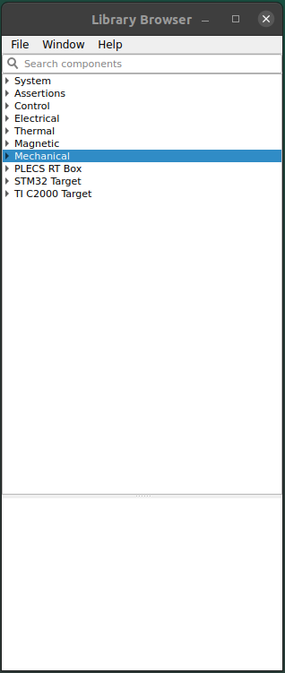

## Getting the OwnModels PLECS library

This section will show you how to add the OwnTech library to your PLECS instance.

**Step 1 -** Go to the [OwnModels repository](https://github.com/owntech-foundation/OwnModels) of the owntech foundation github.
Either clone it locally (if you know how to use git) or download the zip file.

  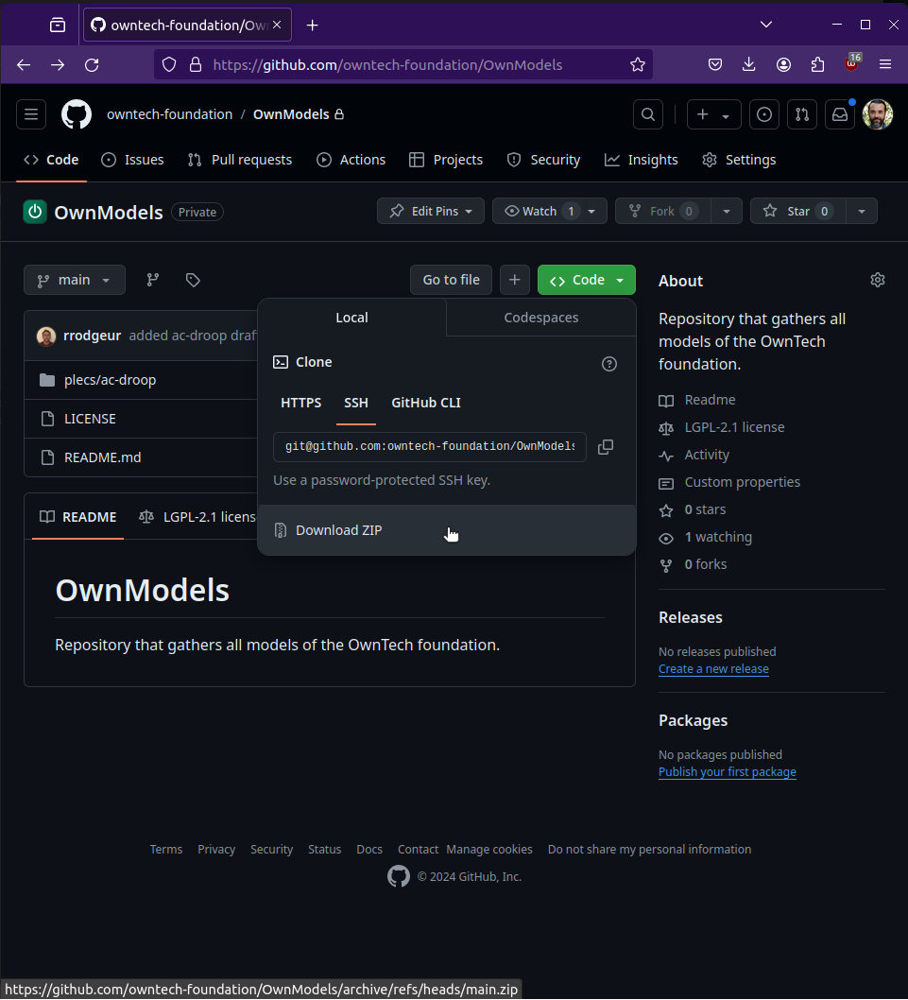

**Step 2 -** Unzip the file if you use zip. Keep the path at hand.

**Step 3 -** In *PLECS Library Browser* go to *File->PLECS Preferences*

  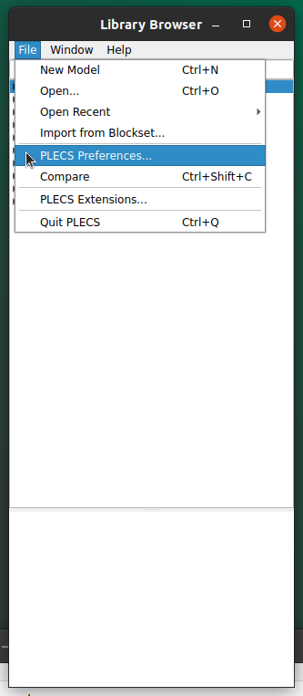

**Step 4 -** In *PLECS Preferences* click on the *Libraries* tab. You will see two sub blocks, *search path* and *user libraries*.

  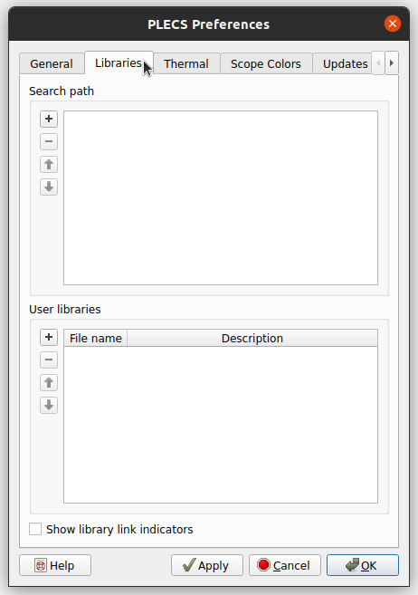

**Step 5 -** In *Libraries->Search path* click on the *+* icon and navigate to the **owntech-lib** folder. Click on *Choose*.

  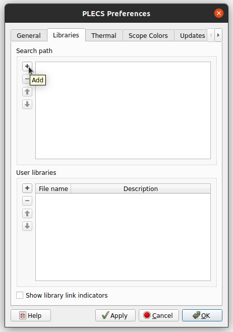

  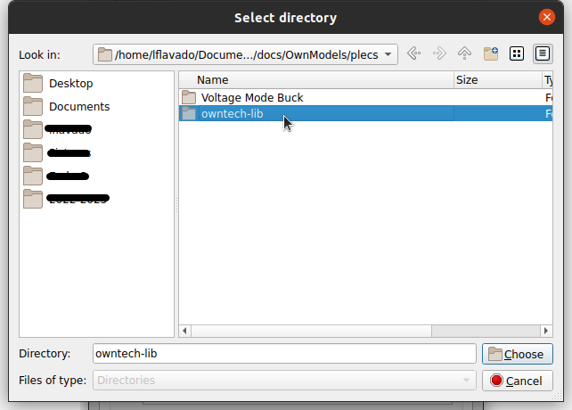

**Step 7 -** In *Libraries->User libraries* click on the *+* icon and navigate to the **Owntech_lib.plecs** file. Click on *Open*.

  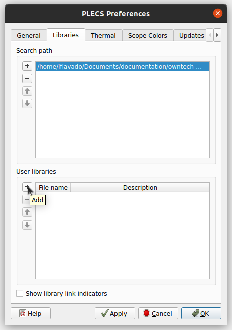

  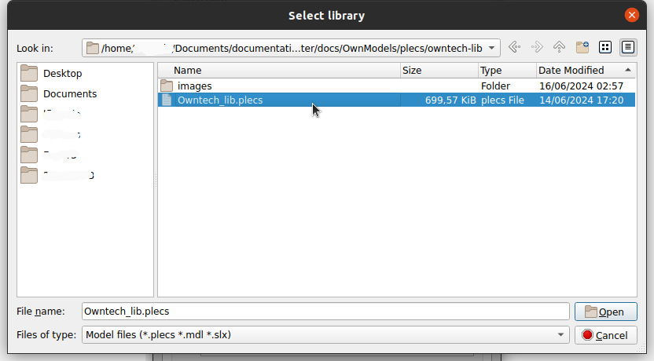

**Step 8 -** Rename the library name from *User Library 1* to *OwnTech*. Click on *Apply* and *Ok* to finish.

  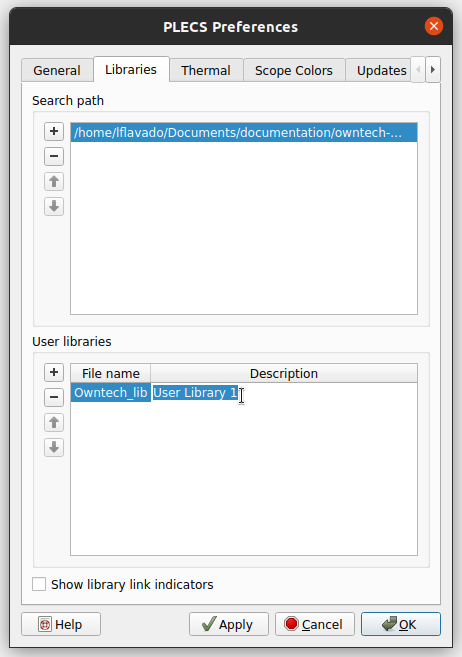

  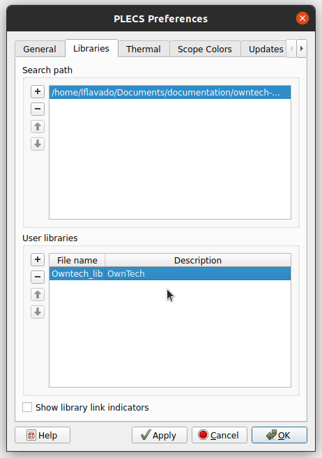

**Step 9 -** Verify that the library is correctly added to the *Library Browser*.

  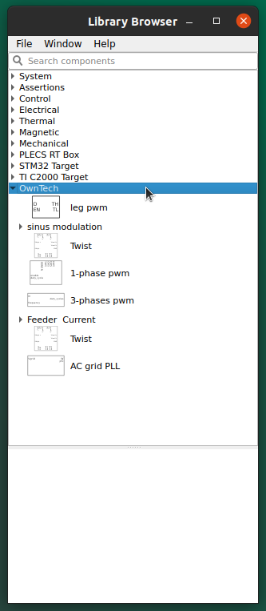

You are now ready to run your first PLECS example.
