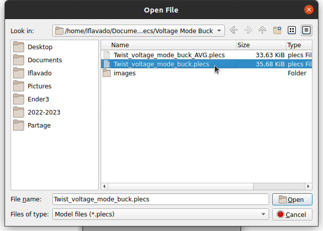
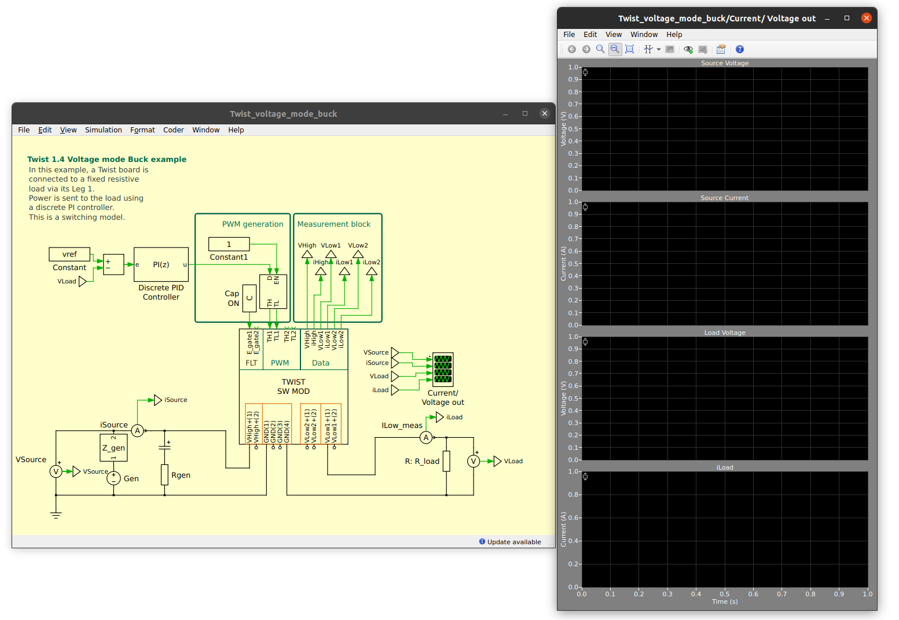
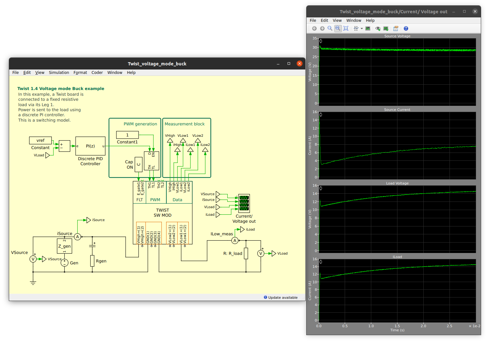
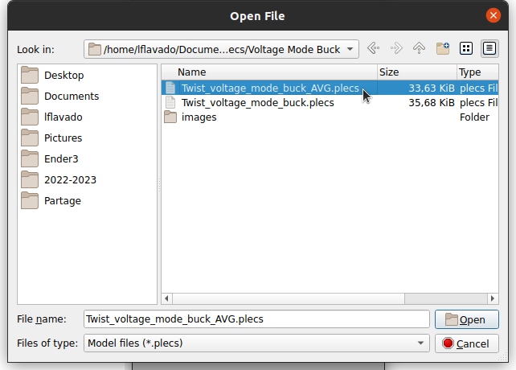
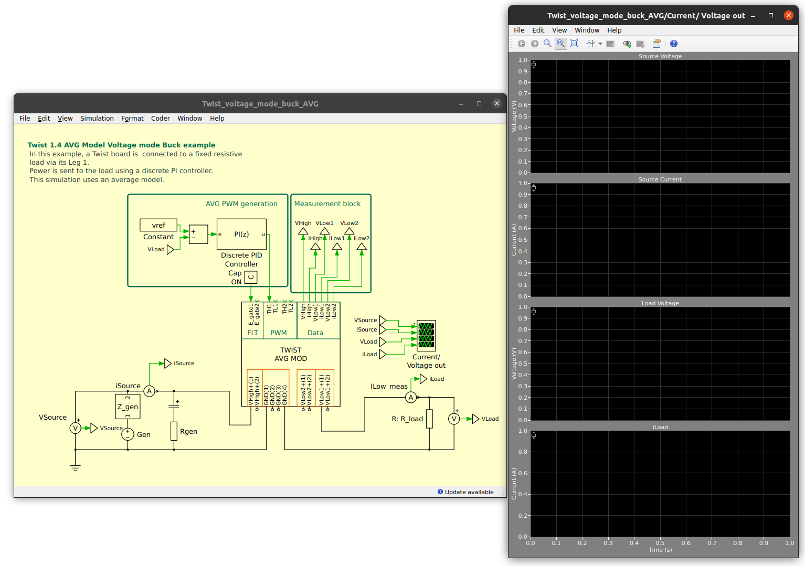

# Voltage mode simulaton

This page shows how to run a closed loop voltage mode PLECS based OwnTech simulation.

## Requirements

Before you start, please make sure you fullfil the requirements below.

!!! note "Requirements"
     - Have installed and configured the licence of your [PLECS instance](getting_started.md#installing-plecs )
     - Setup the [OwnTech PLECS library](getting_started.md#getting-the-ownmodels-plecs-library).
     - Successfully Run an [open-loop simulation](first_example.md).

## Running the closed loop model

The closed loop model is much similar to its open-loop equivalent. Here are the steps to launch it.

**Step 1 -** In *PLECS Library Browser* go to *File->Open*

  

**Step 2 -** Navigate to the *Voltage Mode Buck* folder. Choose* the *Twist_voltage_mode_buck.plecs* and click *Open*.

   

**Step 3 -** You will see the model and a scope window. Notice that there is a discrete PI controller attached to the PWM generator. Press *Ctrl+T* on your computer or click on *Simulation->Start*.

  

**Step 4 -** The simulation will run its course and give you the results as in the image below.

  

You can see an initial in-rush current for loading the Twist board capacitors. The voltage then steadly rises to track its reference of 15 volts.

!!! note "Speed"
    You will notice that this simulation is significantly slower than the open-loop. This is normal as the model used was a switched one. These models are precise, requiring longer to run.

## Running the closed loop model - AVERAGED version

We will now run the averaged version of the closed loop voltage mode model. The idea here is to show you how a less precise model is much faster.

**Step 1 -** In *PLECS Library Browser* go to *File->Open*

  

**Step 2 -** Navigate to the *Voltage Mode Buck* folder. Choose* the *Twist_voltage_mode_buck_AVG.plecs* and click *Open*.

   

**Step 3 -** You will see the model and a scope window. Notice that there is a discrete PI controller attached to the PWM generator. Press *Ctrl+T* on your computer or click on *Simulation->Start*.

  

**Step 4 -** The simulation will run its course and give you the results as in the image below.

  

You can see an initial in-rush current for loading the Twist board capacitors. The voltage then rises to track its reference of 15 volts.

!!! note "Speed"
    Notice how much faster this model is. Using averaged models allows for much faster iteration and study of the system in steady-state conditions. It can also be used whenever the study is much more focused on system-level behavior rather than switching.

You are now ready to start working on a droop control example.