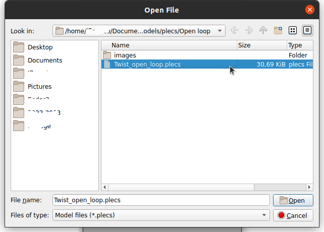

# Plecs Model

## Description

This is a folder with an open-loop example for the Twist Board Switched model.

This simulation is set to :
- Fix the duty cycle to 0.5
- Activate swicthing at 1 milisecond

## Getting started

Make sure you fullfil the following requirements :

- Have installed and configured the licence of your [PLECS instance](https://docs.owntech.org/OwnModels/docs/getting_started/)
- Setup the [OwnTech PLECS library](https://docs.owntech.org/OwnModels/docs/getting_started/#getting-the-ownmodels-plecs-library).

## How to use

- Open PLECS stand alone
- In
- Open the file *Twist_open_loop.plecs*
  
- Verify that you have loaded to correct model from the text on the upper right corner 
- Press *Ctrl+T* to launch a simulation.

## Model limits

- The measured values are not sampled like on the TWIST board
- The model has not been cross-checked with a real TWITS board

## Contributing

- You can fork this git project
- ALWAYS work on a different branch from the main
- Pull regularly from the original project to keep your model up to date
- You are welcome to make push requests to the original model, to do so please reach out to the OwnTech team

## Authors and acknowledgment

This work would not be possible without the help of :

- Emmanuel Roux--Palomo
- Olivier Chevilley
- Regis Ruelland
- Luiz Villa

## License

These models are distributed under GPL V3.0 license.

## Project status

This model must still be matched to the operation of the TWIST 1.4.1.
