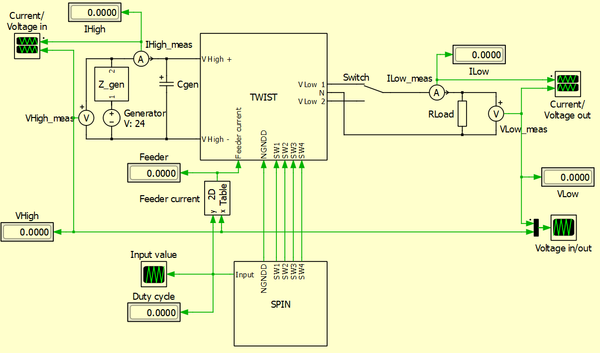

# Plecs Model

## Description 

This is a repository for the OwnTech plecs models, it contains all the tools necessary to its usage.\
This repository contains the digital twin of the TWIST V1.2 and V1.4.1 boards to simulate its power conversion.

This model takes into account several characteristics of the electronic board :
- 200 kHz switching frequency
- PWM signals generated based on this switching frequency

### For the TWIST 1.2
- SPIN and active components current consumption, Feeder (for the Twist 1.2)
> The current consumption values were measured depending on the input voltage, from 12 to 90 V, and duty cycle, 10, 50% and 90%.

This model takes as inputs the high side voltage [V] and the load impedance [Ohm].

## Getting started

Make sure you have : 

- PLECS Stand alone V4.7.5
- The [Owntech-lib](https://gitlab.laas.fr/owntech/models/plecs/owntech-lib/-/tree/New_library?ref_type=heads) repository added to the path
- For the TWIST_1.4.1 to work, you will need the "New_library" branch of the "Owntech-lib" 

## How to use

- Open the file "TWIST_1.2.plecs" or "TWIST_1.4.1.plecs" 
- Configure the input voltage and load impedance as you need
- Click on "Simulation" and "Start"

> You can double click on the "Switch" block to connect the load to leg 2.

## Model limits 

- The measured values are not sampled like on the TWIST board
- The model doesn't take into account power losses produced by the switches
- It has only been tested with a load resistor, real impedance

## Contributing

- You can fork this git project
- ALWAYS work on a different branch from the main
- Pull regularly from the original project to keep your model up to date
- You are welcome to make push requests to the original model, to do so please reach out to the OwnTech team

## Authors and acknowledgment

This work would not be possible without the help of : 

- Emmanuel Roux--Palomo
- Olivier Chevilley
- Regis Ruelland
- Luiz Villa

## License

These models are distributed under GPL V3.0 license. 

## Project status

This model must still be matched to the operation of the TWIST 1.2 and 1.4.1.
